# Component Hierarchy Diagram

## Overview

This diagram shows the layered architecture of the copy-URL-on-hover extension
following Domain-Driven Design and Clean Architecture principles. Dependencies
flow downward (features → storage → domain), ensuring clean separation of
concerns.

## Component Hierarchy

```mermaid
graph TD
    subgraph "UI Layer - Content Script"
        CS[Content Script<br/>src/content.js]
        QTM[QuickTabsManager Facade<br/>src/features/quick-tabs/index.js]
        PM[Panel Manager<br/>src/features/quick-tabs/panel.js]
        NM[NotificationManager<br/>src/features/notifications/]
    end

    subgraph "Features Layer - Managers"
        SM[StateManager<br/>Local state management]
        STM[StorageManager<br/>Persistent storage ops]
        BM[BroadcastManager<br/>Cross-tab messaging]
        EM[EventManager<br/>DOM event handling]
    end

    subgraph "Features Layer - Handlers"
        CH[CreateHandler<br/>Creation logic]
        UH[UpdateHandler<br/>Position/size updates]
        VH[VisibilityHandler<br/>Solo/mute/minimize]
        DH[DestroyHandler<br/>Cleanup logic]
    end

    subgraph "Features Layer - Coordinators"
        UC[UICoordinator<br/>Render Quick Tabs]
        SC[SyncCoordinator<br/>Storage ↔ State sync]
    end

    subgraph "Features Layer - Window Components"
        QTW[QuickTabWindow<br/>Main window class]
        TB[TitlebarBuilder<br/>Titlebar creation]
        DC[DragController<br/>Drag-to-move]
        RC[ResizeController<br/>8-direction resize]
        RH[ResizeHandle<br/>Individual handle]
    end

    subgraph "Features Layer - Panel Components"
        PUB[PanelUIBuilder<br/>DOM creation]
        PDC[PanelDragController<br/>Panel drag]
        PRC[PanelResizeController<br/>Panel resize]
        PSM[PanelStateManager<br/>Panel state]
        PCM[PanelContentManager<br/>Content updates]
    end

    subgraph "Storage Layer - Adapters"
        SA[StorageAdapter<br/>Abstract base]
        SSA[SyncStorageAdapter<br/>browser.storage.sync]
        SESA[SessionStorageAdapter<br/>browser.storage.session]
        FM[FormatMigrator<br/>v1.5.8.13-15 migration]
    end

    subgraph "Domain Layer - Entities"
        QT[QuickTab Entity<br/>Pure business logic]
        CON[Container Entity<br/>Firefox containers]
    end

    subgraph "Background Script"
        BG[background.js<br/>Message routing]
        MR[MessageRouter<br/>Handler registry]
        QTH[QuickTabHandler<br/>CRUD operations]
        LH[LogHandler<br/>Log management]
        TH[TabHandler<br/>Tab operations]
    end

    subgraph "URL Detection System"
        UHR[URL Handler Registry<br/>Site-specific handlers]
        SMH[Social Media Handlers<br/>13 categories]
        GH[Generic Handler<br/>Fallback]
    end

    %% UI Layer connections
    CS --> QTM
    CS --> NM
    CS --> UHR
    QTM --> PM

    %% QuickTabsManager dependencies
    QTM --> SM
    QTM --> STM
    QTM --> BM
    QTM --> EM
    QTM --> CH
    QTM --> UH
    QTM --> VH
    QTM --> DH
    QTM --> UC
    QTM --> SC

    %% Handler dependencies on managers
    CH --> SM
    CH --> STM
    CH --> BM
    UH --> SM
    UH --> STM
    VH --> SM
    DH --> SM
    DH --> STM

    %% Coordinator dependencies
    UC --> QTW
    SC --> SM
    SC --> STM

    %% Window component hierarchy
    QTW --> TB
    QTW --> DC
    QTW --> RC
    RC --> RH

    %% Panel Manager dependencies
    PM --> PUB
    PM --> PDC
    PM --> PRC
    PM --> PSM
    PM --> PCM

    %% Storage layer dependencies
    STM --> SSA
    STM --> SESA
    SSA --> SA
    SESA --> SA
    SSA --> FM
    FM --> QT

    %% Domain entities (foundation)
    CH --> QT
    UH --> QT
    VH --> QT
    DH --> QT
    SM --> QT
    SC --> QT
    STM --> CON

    %% Background script
    BG --> MR
    MR --> QTH
    MR --> LH
    MR --> TH

    %% URL handlers
    UHR --> SMH
    UHR --> GH

    %% Styling
    classDef domainClass fill:#e1f5ff,stroke:#01579b,stroke-width:3px
    classDef storageClass fill:#fff3e0,stroke:#e65100,stroke-width:2px
    classDef featuresClass fill:#f3e5f5,stroke:#4a148c,stroke-width:2px
    classDef uiClass fill:#e8f5e9,stroke:#1b5e20,stroke-width:2px
    classDef backgroundClass fill:#fff9c4,stroke:#f57f17,stroke-width:2px

    class QT,CON domainClass
    class SA,SSA,SESA,FM storageClass
    class SM,STM,BM,EM,CH,UH,VH,DH,UC,SC,QTW,TB,DC,RC,RH,PUB,PDC,PRC,PSM,PCM featuresClass
    class CS,QTM,PM,NM,UHR,SMH,GH uiClass
    class BG,MR,QTH,LH,TH backgroundClass
```



## Dependency Rules

### Layer Dependencies (Enforced by ESLint)

1. **Domain Layer** (Blue)
   - Pure business logic
   - Zero dependencies on other layers
   - No browser APIs, no UI, no storage
   - Entities: `QuickTab`, `Container`

2. **Storage Layer** (Orange)
   - Depends on: Domain layer only
   - Abstract storage operations
   - Handles format migration
   - Classes: `StorageAdapter`, `SyncStorageAdapter`, `SessionStorageAdapter`,
     `FormatMigrator`

3. **Features Layer** (Purple)
   - Depends on: Domain + Storage layers
   - Implements business features
   - Coordinates between layers
   - Components: Managers, Handlers, Coordinators, Window, Panel

4. **UI Layer** (Green)
   - Depends on: All lower layers
   - User-facing components
   - Content script entry point
   - Components: `QuickTabsManager` facade, `PanelManager`,
     `NotificationManager`

5. **Background Script** (Yellow)
   - Independent message routing
   - Coordinates cross-tab state
   - Uses all layers via message handlers

### Facade Pattern

The **QuickTabsManager** acts as a facade that:

- Hides complexity of 10+ internal components
- Provides simple public API for content script
- Orchestrates managers, handlers, and coordinators
- Maintains backward compatibility during refactoring

### Key Architectural Benefits

1. **Testability**: Domain and storage layers are 100% unit testable (no browser
   APIs)
2. **Maintainability**: Each component has single responsibility
3. **Extensibility**: Add new features by creating new handlers/coordinators
4. **Isolation**: Container boundaries enforced at storage + broadcast layers
5. **Performance**: BroadcastChannel enables <10ms cross-tab sync

## Component Responsibilities

### QuickTabsManager (Facade)

- **Purpose**: Single entry point for Quick Tab operations
- **Delegates to**: 5 managers, 4 handlers, 2 coordinators
- **Complexity**: Reduced from cc=25 to cc<3 via decomposition

### StateManager

- **Purpose**: In-memory state management (Map<id, QuickTab>)
- **Operations**: add, update, delete, get, getAll, clear
- **Events**: Emits state change events for listeners

### StorageManager

- **Purpose**: Persistent storage operations
- **Handles**: Save, load, sync, format migration
- **Race conditions**: Uses saveId tracking to prevent overwrites

### BroadcastManager

- **Purpose**: Cross-tab real-time synchronization
- **Channel**: Container-specific (e.g., `quick-tabs-sync-firefox-container-1`)
- **Latency**: <10ms message propagation

### CreateHandler / UpdateHandler / VisibilityHandler / DestroyHandler

- **Purpose**: Encapsulate specific operation logic
- **Pattern**: Orchestrate State → Storage → Broadcast → UI updates
- **Benefit**: Eliminates duplication across similar operations

### UICoordinator

- **Purpose**: Render QuickTab entities to QuickTabWindow instances
- **Lifecycle**: create → render → update → destroy
- **Separation**: Domain entities ≠ UI components

### SyncCoordinator

- **Purpose**: Route broadcast messages + coordinate storage ↔ state sync
- **Handles**: Storage changes, broadcast messages, conflict resolution

## Container Isolation Architecture

```mermaid
graph LR
    subgraph "Container 1"
        C1_QT[Quick Tabs<br/>Container 1]
        C1_BC[BroadcastChannel<br/>quick-tabs-sync-<br/>firefox-container-1]
        C1_Storage[Storage<br/>containers['firefox-container-1']]
    end

    subgraph "Container 2"
        C2_QT[Quick Tabs<br/>Container 2]
        C2_BC[BroadcastChannel<br/>quick-tabs-sync-<br/>firefox-container-2]
        C2_Storage[Storage<br/>containers['firefox-container-2']]
    end

    C1_QT --> C1_BC
    C1_QT --> C1_Storage
    C2_QT --> C2_BC
    C2_QT --> C2_Storage

    C1_BC -.->|Isolated| C1_BC
    C2_BC -.->|Isolated| C2_BC

    style C1_BC fill:#ffcdd2
    style C2_BC fill:#c8e6c9
```

**Key**: Each container has its own:

- BroadcastChannel (automatic message isolation)
- Storage namespace (manual filtering by cookieStoreId)
- State partition in StateManager

This ensures Quick Tabs created in "Personal" container never appear in "Work"
container.

## Related Documentation

- [State Synchronization Flow](./2-state-synchronization-flow.md)
- [Storage Architecture](./3-storage-architecture.md)
- [Message Routing](./4-message-routing.md)
- [URL Handler Registry](./5-url-handler-registry.md)
