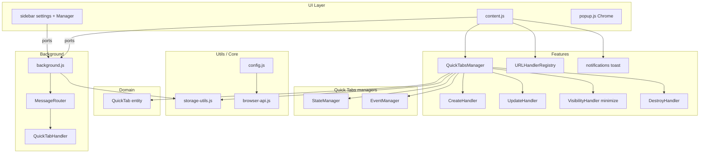

# Component Hierarchy

## Overview

Firefox-first Manifest V2 extension. Dependencies flow features → utils/core →
domain. Quick Tabs are **tab-scoped** (`originTabId`). Sync is Option 4:
background in-memory session + ports + `storage.local`.

## Component Hierarchy

```mermaid
flowchart TD
  subgraph ui [UI Layer]
    CS[content.js]
    SB[sidebar settings + Manager]
    POP[popup.js Chrome]
  end

  subgraph features [Features]
    QTM[QuickTabsManager]
    CH[CreateHandler]
    UH[UpdateHandler]
    VH[VisibilityHandler minimize]
    DH[DestroyHandler]
    UHR[URLHandlerRegistry]
    NM[notifications toast]
  end

  subgraph managers [Quick Tabs managers]
    SM[StateManager]
    EM[EventManager]
  end

  subgraph utils [Utils / Core]
    SU[storage-utils.js]
    BA[browser-api.js]
    CFG[config.js]
  end

  subgraph domain [Domain]
    QT[QuickTab entity]
  end

  subgraph bg [Background]
    BG[background.js]
    MR[MessageRouter]
    QTH[QuickTabHandler]
  end

  CS --> QTM
  CS --> UHR
  CS --> NM
  CS -->|ports| BG
  SB -->|ports| BG
  QTM --> CH
  QTM --> UH
  QTM --> VH
  QTM --> DH
  QTM --> SM
  QTM --> EM
  QTM --> QT
  BG --> MR
  MR --> QTH
  BG --> SU
  QTM --> SU
  CFG --> BA
```

## Layers

| Layer | Role |
|-------|------|
| Content / sidebar / popup | Hover copy, QT windows, Manager UI |
| Features | Quick Tabs facade + handlers; URL registry; in-page notifications |
| Utils / core | `storage-utils`, clipboard, config, DOM helpers |
| Domain | Pure `QuickTab` entity |
| Background | Message router, session owner, webRequest XFO strip for iframes |

## Removed (do not resurrect)

- Floating Manager panel (`panel.js`)
- BroadcastManager / BroadcastChannel sync
- `src/storage/*` adapters (`SyncStorageAdapter`, `SessionStorageAdapter`, `FormatMigrator`)
- Solo / Mute visibility controls
- `src/ui/` CSS/module tree
