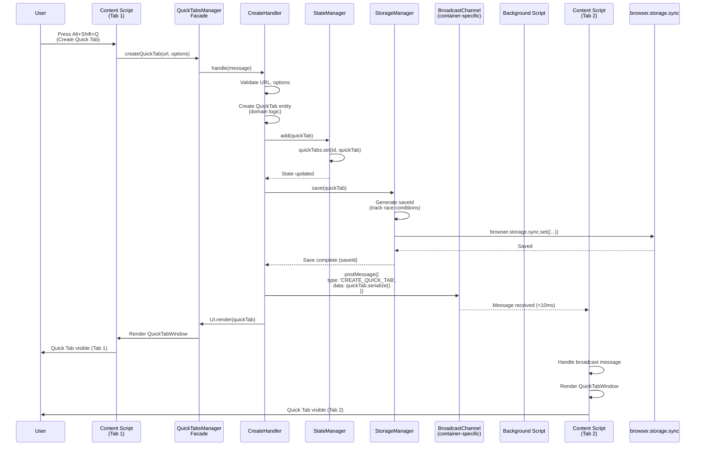
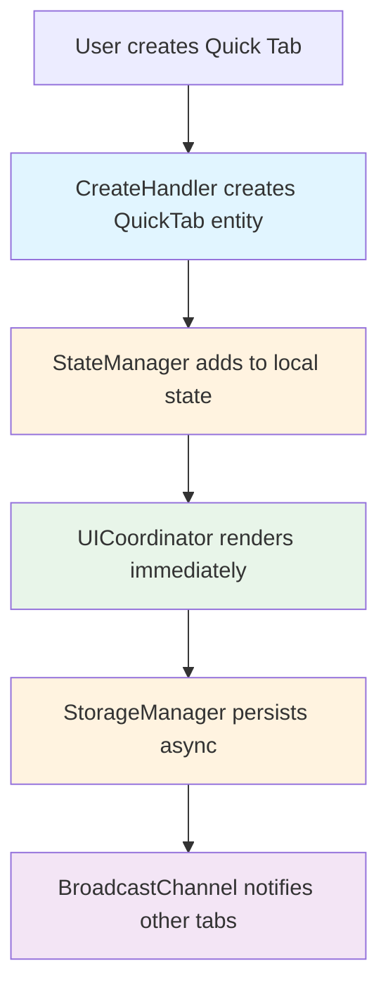
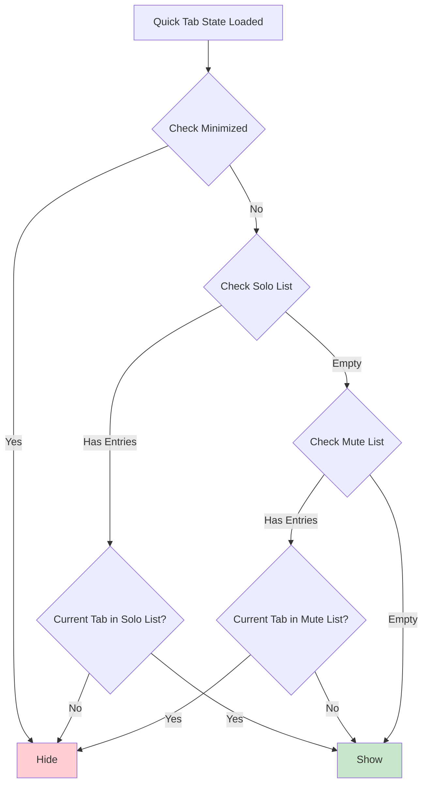
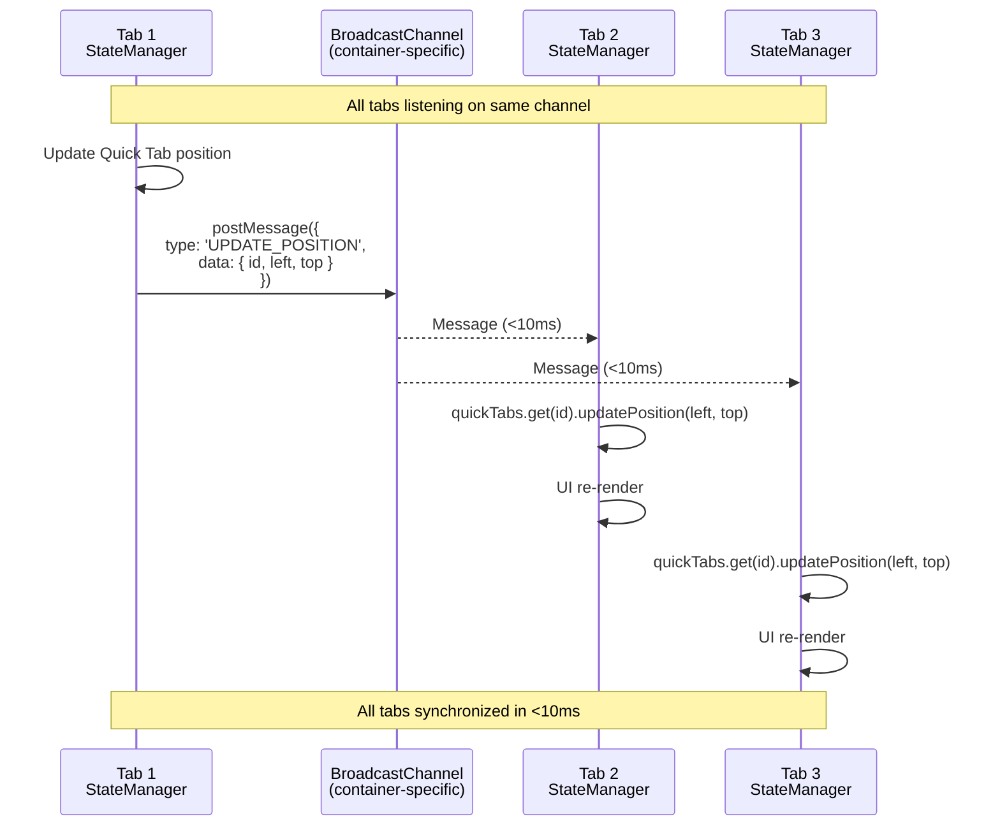
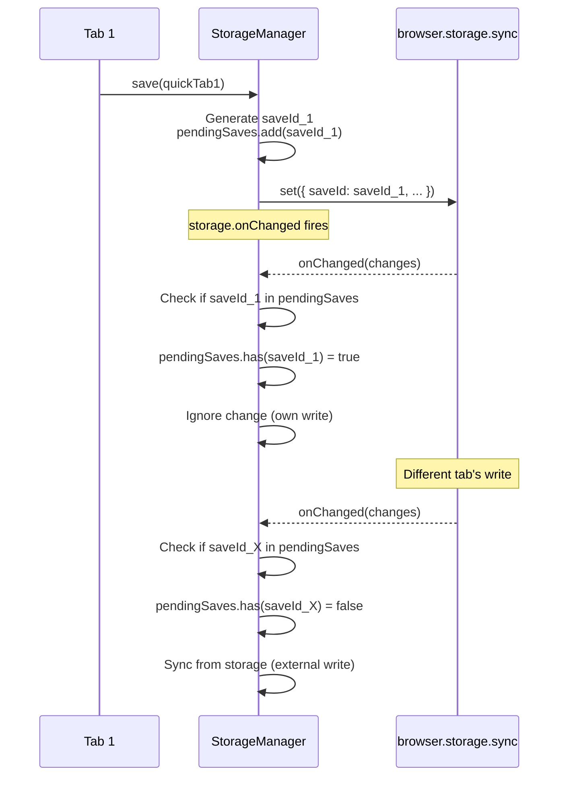
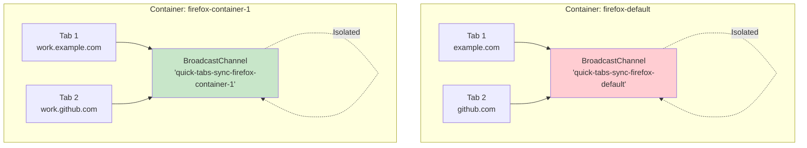
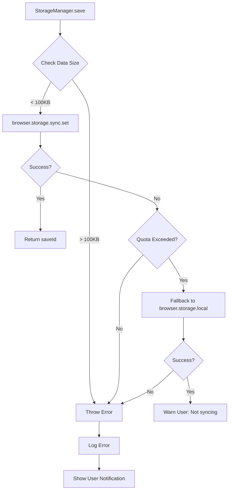

# State Synchronization Flow

## Overview

This document explains how Quick Tab state is synchronized across multiple execution contexts (content scripts, background script, browser storage) and browser tabs in real-time.

## Quick Tab Lifecycle



## State Synchronization Patterns

### Pattern 1: Direct Local Creation (v1.5.9.11+)

**Problem Solved**: Quick Tabs created in Tab 1 didn't appear immediately in Tab 1 (race condition)

**Solution**: Content script creates and renders immediately, THEN notifies background for persistence



**Result**: <50ms local render, <100ms persistence, <10ms cross-tab sync

### Pattern 2: Solo/Mute Visibility Filtering

**Feature**: v1.5.9.13 - Tab-specific visibility control



**Implementation**: Domain entity method `QuickTab.shouldBeVisible(tabId)`

### Pattern 3: Cross-Tab State Sync



**Key**: BroadcastChannel provides instant sync without polling storage

### Pattern 4: Storage Race Condition Prevention

**Problem**: Multiple tabs saving simultaneously could overwrite each other's changes

**Solution**: SaveId tracking + debouncing



**Result**: Each tab ignores its own writes, only syncs from other tabs

## Container Isolation

### Container-Specific BroadcastChannel



**Key**: Each container uses a different channel name, providing automatic message isolation

### Container-Filtered Storage

```mermaid
graph LR
    A[browser.storage.sync] --> B{FormatMigrator<br/>Detect Version}

    B -->|v1.5.8.15+| C[containers: {<br/>'firefox-default': {...},<br/>'firefox-container-1': {...}<br/>}]

    B -->|v1.5.8.14| D[Unwrapped object<br/>(migrate to containers)]

    B -->|Legacy| E[tabs: []<br/>(migrate to containers)]

    C --> F[Filter by cookieStoreId]
    D --> F
    E --> F

    F --> G[Return container-specific tabs]

    style C fill:#c8e6c9
    style D fill:#fff9c4
    style E fill:#ffcdd2
```

**Implementation**: `SyncStorageAdapter.load(containerId)` filters at read time

## State Coordination Scenarios

### Scenario 1: Create Quick Tab

**Starting State**: No Quick Tabs exist

**Actions**:

1. User presses `Alt+Shift+Q` in Tab 1 (Container: firefox-default)
2. CreateHandler creates QuickTab entity
3. StateManager adds to local Map
4. UICoordinator renders QuickTabWindow
5. StorageManager persists to browser.storage.sync
6. BroadcastManager notifies channel `'quick-tabs-sync-firefox-default'`
7. Tab 2 (same container) receives broadcast, renders Quick Tab
8. Tab 3 (different container) doesn't receive broadcast, no action

**Final State**:

- Tab 1: Quick Tab visible (local render)
- Tab 2: Quick Tab visible (broadcast sync)
- Tab 3: No Quick Tab (different container)

### Scenario 2: Solo Quick Tab on Tab 1

**Starting State**: Quick Tab visible in Tab 1, Tab 2, Tab 3 (all same container)

**Actions**:

1. User clicks Solo button in Tab 1
2. VisibilityHandler calls `quickTab.solo(Tab1.id)`
3. Domain logic: `visibility.soloedOnTabs = [Tab1.id]`, `visibility.mutedOnTabs = []`
4. StateManager updates entity
5. StorageManager persists new visibility state
6. BroadcastManager sends `SOLO_QUICK_TAB` message
7. Tab 2, Tab 3 receive broadcast
8. Each tab calls `quickTab.shouldBeVisible(currentTabId)`
   - Tab 1: `shouldBeVisible(Tab1.id) = true` (in solo list) → Show
   - Tab 2: `shouldBeVisible(Tab2.id) = false` (not in solo list) → Hide
   - Tab 3: `shouldBeVisible(Tab3.id) = false` (not in solo list) → Hide

**Final State**:

- Tab 1: Quick Tab visible
- Tab 2: Quick Tab hidden
- Tab 3: Quick Tab hidden

### Scenario 3: Resize Quick Tab

**Starting State**: Quick Tab visible at 800x600

**Actions**:

1. User drags resize handle in Tab 1
2. ResizeController detects `pointermove` events
3. UpdateHandler debounces resize updates (50ms)
4. When debounce expires:
   - StateManager updates entity: `quickTab.updateSize(900, 650)`
   - StorageManager persists new size
   - BroadcastManager sends `UPDATE_SIZE` message
5. Tab 2, Tab 3 receive broadcast
6. Each tab updates local QuickTab entity size
7. UICoordinator re-renders QuickTabWindow with new dimensions

**Final State**: All tabs show Quick Tab at 900x650

### Scenario 4: Tab Closes (Cleanup Dead Tab IDs)

**Starting State**: Quick Tab soloed on Tab 2 (ID: 123)

**Actions**:

1. User closes Tab 2
2. Background script receives `tabs.onRemoved(tabId: 123)`
3. StateCoordinator detects tab closure
4. For each Quick Tab:
   - Get active tab IDs: `[Tab1.id, Tab3.id]`
   - Call `quickTab.cleanupDeadTabs([Tab1.id, Tab3.id])`
   - Domain logic removes 123 from `soloedOnTabs`
   - Result: `soloedOnTabs = []` (empty)
5. StorageManager persists cleaned state
6. BroadcastManager notifies all tabs
7. Tab 1, Tab 3 receive broadcast, update visibility
8. Since solo list is now empty, Quick Tab becomes visible everywhere

**Final State**: Quick Tab visible in Tab 1, Tab 3 (no longer soloed)

## Performance Characteristics

| Operation               | Latency  | Details                                        |
| ----------------------- | -------- | ---------------------------------------------- |
| **Local Create**        | <50ms    | Direct DOM manipulation + state update         |
| **Cross-Tab Broadcast** | <10ms    | BroadcastChannel is synchronous within browser |
| **Storage Persist**     | 30-100ms | Async browser.storage.sync.set()               |
| **Storage Load (Init)** | 20-50ms  | Async browser.storage.sync.get()               |
| **Visibility Check**    | <1ms     | Pure JS array filtering in domain entity       |
| **Format Migration**    | <10ms    | Strategy pattern, minimal overhead             |

## Error Handling & Edge Cases

### Storage Quota Exceeded



### Broadcast Message Failures

**Scenario**: Tab is closed before receiving broadcast

**Handling**: No action needed - state will sync from storage on next load

### Container Detection Failures

**Scenario**: `cookieStoreId` not available in content script

**Handling**:

1. Content script requests tab info from background: `browser.runtime.sendMessage({ action: 'GET_TAB_INFO' })`
2. Background responds with `sender.tab.cookieStoreId`
3. Content script caches container ID for session
4. Fallback: Use 'firefox-default' if detection fails

## Related Documentation

- [Component Hierarchy](./1-component-hierarchy.md)
- [Storage Architecture](./3-storage-architecture.md)
- [Message Routing](./4-message-routing.md)
- [Container Isolation Implementation](../implementation-summaries/IMPLEMENTATION-SUMMARY-container-integration-v1.5.9.12.md)
