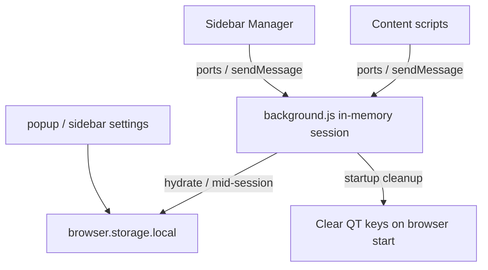

# Storage Architecture

## Overview

Quick Tab and settings persistence use **`browser.storage.local`** via
[`src/utils/storage-utils.js`](../../src/utils/storage-utils.js) and
[`background.js`](../../background.js).

There is **no** `src/storage/` adapter layer. Older docs referred to
`SyncStorageAdapter` / `SessionStorageAdapter` / `FormatMigrator`; those modules
were production-orphaned and have been removed.

## Current model (Option 4)


```mermaid
flowchart TD
  CS[Content scripts] -->|ports / sendMessage| BG[background.js in-memory session]
  SB[Sidebar Manager] -->|ports / sendMessage| BG
  BG -->|hydrate / mid-session| Local[browser.storage.local]
  BG -->|startup cleanup| Clear[Clear QT keys on browser start]
  Settings[popup / sidebar settings] --> Local
```

| Concern | Mechanism |
|---------|-----------|
| Settings / shortcuts | `storage.local` flat keys (`ConfigManager` / `DEFAULT_CONFIG`) |
| Quick Tab mid-session state | Background in-memory + `storage.session` when available (FF 115+), else `storage.local` key `quick_tabs_state_v2` |
| Session-like semantics | Native `storage.session` clear on browser stop; local fallback uses startup wipe |
| Realtime sync | `runtime.connect` ports (`quick-tabs-port`); not BroadcastChannel |
| Product scope | **Tab-scoped** Quick Tabs (`originTabId`); Manager lists all, DOM only on origin |

## Canonical key

```javascript
{
  "quick_tabs_state_v2": {
    "tabs": [
      {
        "id": "qt-...",
        "url": "https://example.com",
        "originTabId": 123,
        "originContainerId": "firefox-default",
        "position": { "left": 100, "top": 100 },
        "size": { "width": 800, "height": 600 },
        "visibility": { "minimized": false }
      }
    ],
    "saveId": "...",
    "timestamp": 0
  }
}
```

## Explicitly removed / not used

- `browser.storage.session` from content scripts (Firefox does not expose it to CS by default)
- `browser.storage.sync` for Quick Tabs or settings (options page path removed)
- BroadcastChannel as a sync bus
- Solo/Mute visibility arrays

## Related code

- Persistence helpers: `src/utils/storage-utils.js`
- Background session + ports: `background.js`
- Domain entity: `src/domain/QuickTab.js`
