# Storage Architecture

## Overview

The storage layer provides an abstraction over browser storage APIs
(`browser.storage.sync` and `browser.storage.session`) with automatic format
migration, container isolation, and race condition prevention.

## Storage Layer Architecture


## Storage Format Evolution

### v1.5.8.15+ (Current) - Container-Aware Format

```javascript
{
  "quick_tabs_state_v2": {
    "containers": {
      "firefox-default": {
        "tabs": [
          {
            "id": "qt-1234567890",
            "url": "https://example.com",
            "title": "Example Site",
            "position": { "left": 100, "top": 100 },
            "size": { "width": 800, "height": 600 },
            "visibility": {
              "minimized": false,
              "soloedOnTabs": [],
              "mutedOnTabs": []
            },
            "container": "firefox-default",
            "zIndex": 1000,
            "createdAt": 1699876543210
          }
        ],
        "lastUpdate": 1699876543210
      },
      "firefox-container-1": {
        "tabs": [...],
        "lastUpdate": 1699876543220
      }
    },
    "saveId": "1699876543210-abc123xyz",
    "timestamp": 1699876543210
  }
}
```

**Benefits**:

- Complete container isolation
- Explicit lastUpdate per container
- SaveId for race condition tracking
- Easy to add new containers

### v1.5.8.14 - Unwrapped Format

```javascript
{
  "quick_tabs_state_v2": {
    "firefox-default": {
      "tabs": [...],
      "lastUpdate": 1699876543210
    },
    "firefox-container-1": {
      "tabs": [...],
      "lastUpdate": 1699876543220
    }
  }
}
```

**Issues**:

- Container keys mixed with metadata keys
- Hard to distinguish containers from other properties
- No global saveId or timestamp

### Legacy - Flat Array

```javascript
{
  "quick_tabs_state_v2": {
    "tabs": [
      {
        "id": "qt-123",
        "url": "https://example.com",
        // No container property, no visibility
      }
    ],
    "timestamp": 1699876543210
  }
}
```

**Issues**:

- No container support
- No solo/mute features
- All tabs visible to all tabs

## Format Migration Strategy Pattern


### Format Detection Logic

```javascript
class FormatMigrator {
  detect(data) {
    // Empty or invalid
    if (!data || typeof data !== 'object') {
      return new EmptyStrategy();
    }

    // v1.5.8.15+ format (containers key exists)
    if (data.containers && typeof data.containers === 'object') {
      return new V1_5_8_15_Strategy();
    }

    // v1.5.8.14 format (unwrapped containers, no 'tabs' key)
    if (!Array.isArray(data.tabs) && !data.containers) {
      return new V1_5_8_14_Strategy();
    }

    // Legacy format (flat tabs array)
    if (Array.isArray(data.tabs) || data.tabs) {
      return new LegacyStrategy();
    }

    // Fallback
    return new EmptyStrategy();
  }
}
```

## Storage Adapter Interface

### Abstract Base Class

```javascript
class StorageAdapter {
  /**
   * Save Quick Tabs for a specific container
   * @returns {Promise<string>} Save ID for tracking race conditions
   */
  async save(containerId, tabs) {
    throw new Error('Must implement');
  }

  /**
   * Load Quick Tabs for a specific container
   * @returns {Promise<{tabs: QuickTab[], lastUpdate: number}|null>}
   */
  async load(containerId) {
    throw new Error('Must implement');
  }

  /**
   * Load all Quick Tabs across all containers
   * @returns {Promise<Object.<string, {tabs: QuickTab[], lastUpdate: number}>>}
   */
  async loadAll() {
    throw new Error('Must implement');
  }

  async delete(containerId, quickTabId) {}
  async deleteContainer(containerId) {}
  async clear() {}
}
```

## SyncStorageAdapter Implementation

### Save Operation Flow


### Load Operation Flow


### Storage Change Listener (Race Condition Prevention)


**Key**: Each tab tracks its own writes via `pendingSaves` Set, preventing
infinite sync loops

## Container Isolation

### Storage Namespace Isolation

```mermaid
graph TB
    subgraph "browser.storage.sync"
        Root[quick_tabs_state_v2]
    end

    subgraph "Containers"
        Root --> C1[firefox-default<br/>tabs: [...]]
        Root --> C2[firefox-container-1<br/>tabs: [...]]
        Root --> C3[firefox-container-2<br/>tabs: [...]]
        Root --> C4[firefox-private<br/>tabs: [...]]
    end

    subgraph "Tab 1 (Container 1)"
        T1[SyncStorageAdapter]
        T1 -.->|load('firefox-container-1')| C2
        T1 -.->|Cannot access| C1
        T1 -.->|Cannot access| C3
        T1 -.->|Cannot access| C4
    end

    subgraph "Tab 2 (Default)"
        T2[SyncStorageAdapter]
        T2 -.->|load('firefox-default')| C1
        T2 -.->|Cannot access| C2
        T2 -.->|Cannot access| C3
        T2 -.->|Cannot access| C4
    end

    style C1 fill:#ffcdd2
    style C2 fill:#c8e6c9
    style C3 fill:#bbdefb
    style C4 fill:#fff9c4
```

**Implementation**:

- Each `SyncStorageAdapter.load(containerId)` only returns data for that
  container
- Other containers' data is never exposed to the calling code
- Enforced at adapter level, not application level

## SessionStorageAdapter (Tab-Local Storage)

### Use Cases

1. **Temporary state** (e.g., panel open/closed state)
2. **High-frequency updates** (e.g., drag position during resize)
3. **Large data** (no quota limit)
4. **Tab-specific cache** (cleared when tab closes)

### Storage Format (Same as Sync)

```javascript
{
  "quick_tabs_state_v2": {
    "containers": {
      "firefox-default": {
        "tabs": [...],
        "lastUpdate": 1699876543210
      }
    }
  }
}
```

**Difference from Sync**:

- Uses `browser.storage.session` API
- No quota limit
- Data cleared when tab/window closes
- NOT synced across devices
- No saveId tracking needed (single-tab only)

## Error Handling

### Quota Exceeded

```mermaid
graph TD
    A[SyncStorageAdapter.save] --> B{Check Size}
    B -->|< 100KB| C[browser.storage.sync.set]
    B -->|≥ 100KB| D[Throw ValidationError]

    C --> E{Success?}
    E -->|Yes| F[Return saveId]
    E -->|No| G{Check Error Type}

    G -->|QUOTA_BYTES| H[Log warning]
    H --> I[Fallback: browser.storage.local.set]
    I --> J{Success?}
    J -->|Yes| K[Show user notification<br/>'Sync disabled']
    J -->|No| L[Throw StorageError]

    G -->|Other Error| M[Throw StorageError]

    style F fill:#c8e6c9
    style K fill:#fff9c4
    style D fill:#ffcdd2
    style L fill:#ffcdd2
    style M fill:#ffcdd2
```



### Storage Corruption

```mermaid
graph TD
    A[SyncStorageAdapter.load] --> B[browser.storage.sync.get]
    B --> C{Data Valid?}

    C -->|Yes| D[FormatMigrator.detect]
    D --> E[Parse and return]

    C -->|No: Corrupted| F[Log error]
    F --> G[Clear corrupted data]
    G --> H[Return empty state]
    H --> I[Show user notification<br/>'Storage reset']

    C -->|No: Empty| J[Return empty state<br/>(first run)]

    style E fill:#c8e6c9
    style H fill:#fff9c4
    style J fill:#e0e0e0
```

## Storage Performance

| Operation   | SyncStorageAdapter | SessionStorageAdapter | Notes                          |
| ----------- | ------------------ | --------------------- | ------------------------------ |
| **Save**    | 30-100ms           | 10-30ms               | Sync is slower due to network  |
| **Load**    | 20-50ms            | 5-20ms                | Session is faster (local only) |
| **LoadAll** | 50-150ms           | 20-50ms               | Depends on # of containers     |
| **Delete**  | 30-100ms           | 10-30ms               | Same as save                   |
| **Clear**   | 30-100ms           | 10-30ms               | Full wipe                      |

**Optimizations**:

- Debounced saves (50ms) prevent storage spam during resize
- SaveId tracking eliminates unnecessary sync operations
- FormatMigrator caches strategy for repeated operations
- Container-filtered loads reduce data transfer

## Storage API Comparison

| Feature         | browser.storage.sync | browser.storage.session | browser.storage.local |
| --------------- | -------------------- | ----------------------- | --------------------- |
| **Quota**       | 100KB total          | Unlimited               | ~10MB                 |
| **Sync**        | Cross-device         | No                      | No                    |
| **Persistence** | Permanent            | Tab session             | Permanent             |
| **Speed**       | Slow (network)       | Fast (memory)           | Medium (disk)         |
| **Use Case**    | Settings, state      | Temporary cache         | Large data fallback   |

## Related Documentation

- [Component Hierarchy](./1-component-hierarchy.md)
- [State Synchronization Flow](./2-state-synchronization-flow.md)
- [FormatMigrator Tests](../tests/unit/storage/FormatMigrator.test.js)
- [SyncStorageAdapter Tests](../tests/unit/storage/SyncStorageAdapter.test.js)
