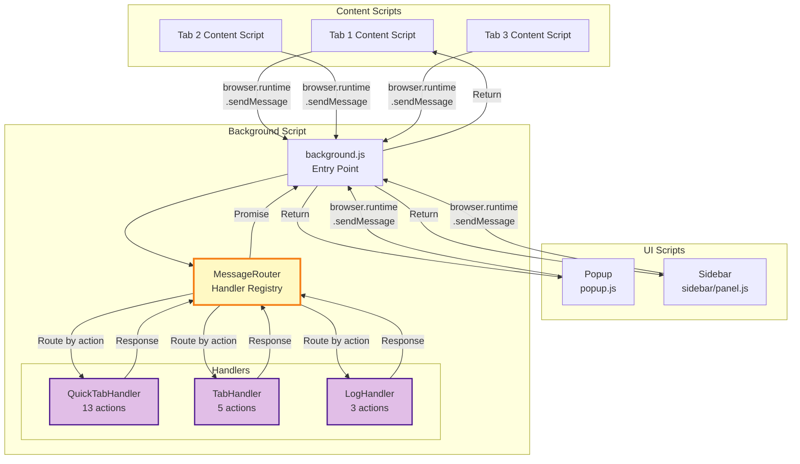
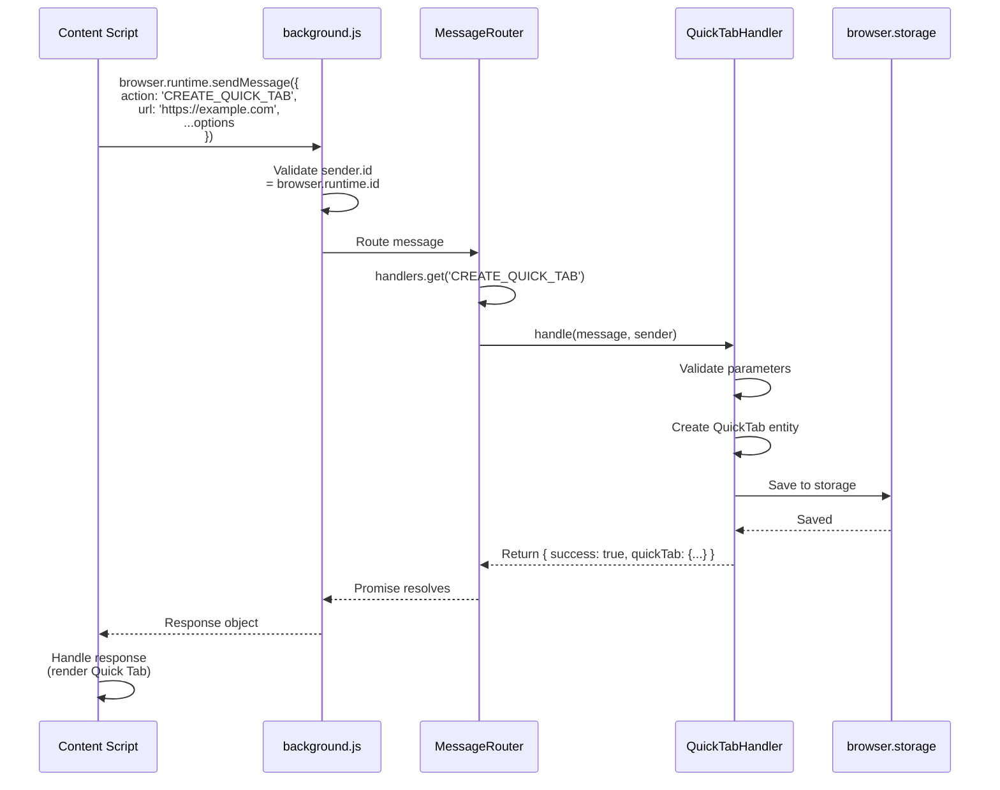
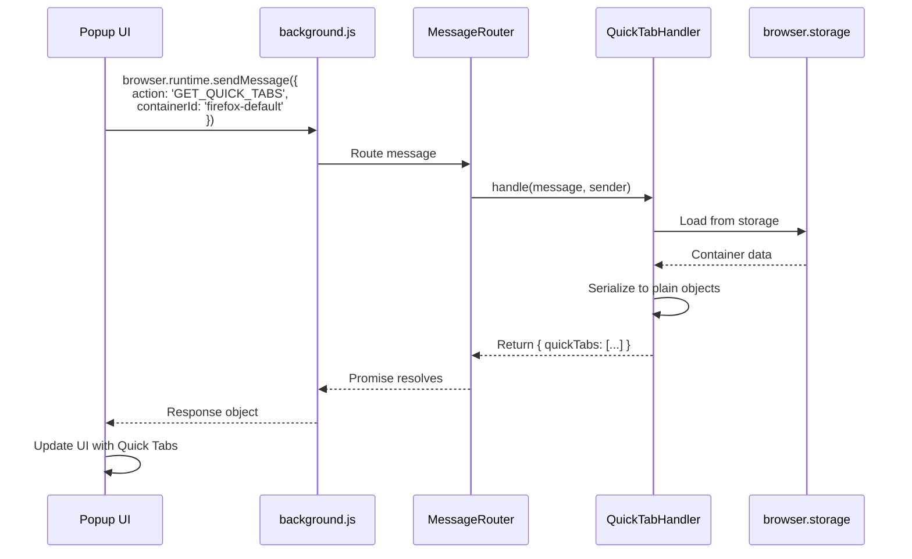
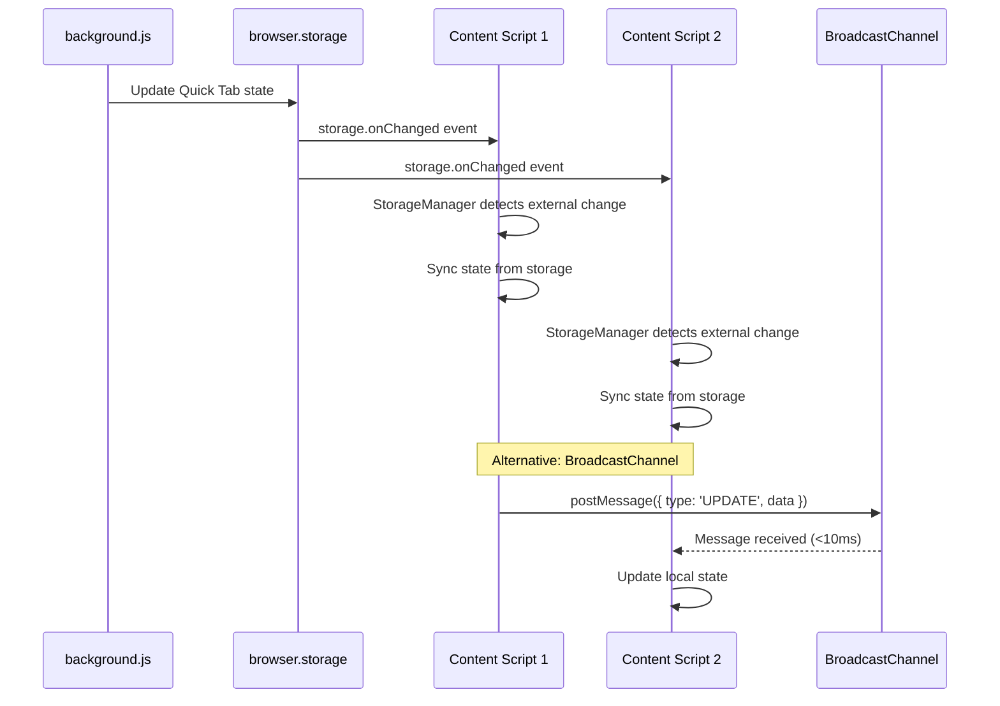
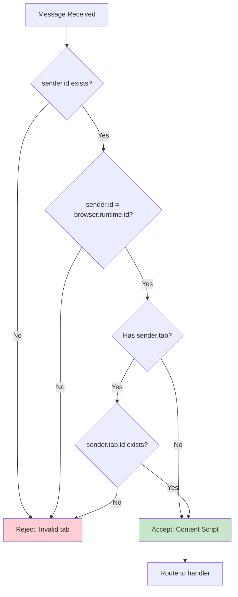

# Message Routing Architecture

## Overview

The extension uses a MessageRouter pattern in the background script to handle cross-context communication between content scripts, popup, sidebar, and background script. This document explains the routing architecture, message flow, and security validation.

## Message Router Architecture



## MessageRouter Implementation

### Registry Pattern

```javascript
class MessageRouter {
  constructor() {
    this.handlers = new Map();
  }

  /**
   * Register a handler for specific action(s)
   */
  register(action, handler) {
    if (Array.isArray(action)) {
      action.forEach(a => this.handlers.set(a, handler));
    } else {
      this.handlers.set(action, handler);
    }
  }

  /**
   * Create browser.runtime.onMessage listener
   */
  createListener() {
    return (message, sender, sendResponse) => {
      // Security: Validate sender
      if (!this._isAuthorizedSender(sender)) {
        console.error('[MessageRouter] Unauthorized sender:', sender);
        return Promise.reject(new Error('Unauthorized sender'));
      }

      // Get handler for action
      const handler = this.handlers.get(message.action);
      
      if (!handler) {
        console.warn('[MessageRouter] No handler for action:', message.action);
        return Promise.resolve({ error: 'Unknown action' });
      }

      // Route to handler
      return handler.handle(message, sender);
    };
  }

  /**
   * Validate message sender (security)
   * @private
   */
  _isAuthorizedSender(sender) {
    // Must be from this extension
    if (!sender.id || sender.id !== browser.runtime.id) {
      return false;
    }

    // Tab sender must have valid ID
    if (sender.tab && !sender.tab.id) {
      return false;
    }

    return true;
  }
}
```

### Registration (background.js)

```javascript
import { MessageRouter } from './background/MessageRouter.js';
import { QuickTabHandler } from './background/handlers/QuickTabHandler.js';
import { TabHandler } from './background/handlers/TabHandler.js';
import { LogHandler } from './background/handlers/LogHandler.js';

// Create router
const router = new MessageRouter();

// Register handlers
const quickTabHandler = new QuickTabHandler(/* dependencies */);
router.register([
  'CREATE_QUICK_TAB',
  'CLOSE_QUICK_TAB',
  'UPDATE_QUICK_TAB_POSITION',
  'UPDATE_QUICK_TAB_SIZE',
  'MINIMIZE_QUICK_TAB',
  'RESTORE_QUICK_TAB',
  'SOLO_QUICK_TAB',
  'UNSOLO_QUICK_TAB',
  'MUTE_QUICK_TAB',
  'UNMUTE_QUICK_TAB',
  'GET_QUICK_TABS',
  'GET_QUICK_TAB',
  'CLEANUP_DEAD_TABS'
], quickTabHandler);

const tabHandler = new TabHandler();
router.register([
  'OPEN_TAB',
  'GET_TAB_INFO',
  'SAVE_TAB_STATE',
  'GET_TAB_STATE',
  'CLEAR_TAB_STATE'
], tabHandler);

const logHandler = new LogHandler();
router.register([
  'CLEAR_CONSOLE_LOGS',
  'GET_BACKGROUND_LOGS',
  'EXPORT_LOGS'
], logHandler);

// Install listener
browser.runtime.onMessage.addListener(router.createListener());
```

## Message Flow Patterns

### Pattern 1: Content Script → Background (Request-Response)



### Pattern 2: Popup → Background (UI Query)



### Pattern 3: Background → Content (Broadcast-style)

**Note**: Background script cannot initiate messages to content scripts. Instead, it uses storage changes + BroadcastChannel.



## Handler Structure

### QuickTabHandler (13 Actions)

```javascript
class QuickTabHandler {
  constructor(stateCoordinator, storageAdapter) {
    this.state = stateCoordinator;
    this.storage = storageAdapter;
  }

  async handle(message, sender) {
    const { action } = message;

    switch (action) {
      case 'CREATE_QUICK_TAB':
        return this.handleCreate(message, sender);
      
      case 'CLOSE_QUICK_TAB':
        return this.handleClose(message, sender);
      
      case 'UPDATE_QUICK_TAB_POSITION':
        return this.handleUpdatePosition(message, sender);
      
      case 'UPDATE_QUICK_TAB_SIZE':
        return this.handleUpdateSize(message, sender);
      
      case 'MINIMIZE_QUICK_TAB':
        return this.handleMinimize(message, sender);
      
      case 'RESTORE_QUICK_TAB':
        return this.handleRestore(message, sender);
      
      case 'SOLO_QUICK_TAB':
        return this.handleSolo(message, sender);
      
      case 'UNSOLO_QUICK_TAB':
        return this.handleUnsolo(message, sender);
      
      case 'MUTE_QUICK_TAB':
        return this.handleMute(message, sender);
      
      case 'UNMUTE_QUICK_TAB':
        return this.handleUnmute(message, sender);
      
      case 'GET_QUICK_TABS':
        return this.handleGetAll(message, sender);
      
      case 'GET_QUICK_TAB':
        return this.handleGet(message, sender);
      
      case 'CLEANUP_DEAD_TABS':
        return this.handleCleanup(message, sender);
      
      default:
        return { error: 'Unknown action' };
    }
  }

  async handleCreate(message, sender) {
    try {
      // Extract container from sender
      const containerId = sender.tab?.cookieStoreId || 'firefox-default';
      
      // Create QuickTab entity
      const quickTab = QuickTab.create({
        id: message.id || generateId(),
        url: message.url,
        title: message.title,
        left: message.left,
        top: message.top,
        width: message.width,
        height: message.height,
        container: containerId
      });
      
      // Persist to state
      await this.state.add(quickTab);
      
      // Persist to storage
      await this.storage.save(containerId, [quickTab]);
      
      return {
        success: true,
        quickTab: quickTab.serialize()
      };
    } catch (error) {
      console.error('[QuickTabHandler] Create failed:', error);
      return {
        success: false,
        error: error.message
      };
    }
  }
}
```

### TabHandler (5 Actions)

```javascript
class TabHandler {
  async handle(message, sender) {
    const { action } = message;

    switch (action) {
      case 'OPEN_TAB':
        return this.handleOpenTab(message);
      
      case 'GET_TAB_INFO':
        return this.handleGetTabInfo(sender);
      
      case 'SAVE_TAB_STATE':
        return this.handleSaveState(message, sender);
      
      case 'GET_TAB_STATE':
        return this.handleGetState(message, sender);
      
      case 'CLEAR_TAB_STATE':
        return this.handleClearState(message, sender);
      
      default:
        return { error: 'Unknown action' };
    }
  }

  async handleGetTabInfo(sender) {
    return {
      tabId: sender.tab?.id,
      windowId: sender.tab?.windowId,
      url: sender.tab?.url,
      title: sender.tab?.title,
      cookieStoreId: sender.tab?.cookieStoreId || 'firefox-default'
    };
  }
}
```

### LogHandler (3 Actions)

```javascript
class LogHandler {
  constructor(logBuffer) {
    this.logs = logBuffer;
  }

  async handle(message, sender) {
    const { action } = message;

    switch (action) {
      case 'CLEAR_CONSOLE_LOGS':
        return this.handleClearLogs();
      
      case 'GET_BACKGROUND_LOGS':
        return this.handleGetLogs();
      
      case 'EXPORT_LOGS':
        return this.handleExportLogs(message);
      
      default:
        return { error: 'Unknown action' };
    }
  }

  async handleExportLogs(message) {
    try {
      // Create Blob from log text
      const blob = new Blob([message.logText], { type: 'text/plain' });
      const url = URL.createObjectURL(blob);
      
      // Start download with saveAs dialog
      const downloadId = await browser.downloads.download({
        url: url,
        filename: message.filename,
        saveAs: true
      });
      
      // Cleanup URL after download completes
      const cleanup = (delta) => {
        if (delta.id === downloadId && delta.state?.current === 'complete') {
          URL.revokeObjectURL(url);
          browser.downloads.onChanged.removeListener(cleanup);
        }
      };
      browser.downloads.onChanged.addListener(cleanup);
      
      // Fallback cleanup after 60s
      setTimeout(() => {
        URL.revokeObjectURL(url);
      }, 60000);
      
      return { success: true, downloadId };
    } catch (error) {
      console.error('[LogHandler] Export failed:', error);
      return { success: false, error: error.message };
    }
  }
}
```

## Message Security

### Sender Validation



**Implementation**:
```javascript
_isAuthorizedSender(sender) {
  // Must be from this extension
  if (!sender.id || sender.id !== browser.runtime.id) {
    console.error('Unauthorized sender ID:', sender.id);
    return false;
  }

  // Tab sender must have valid ID
  if (sender.tab && !sender.tab.id) {
    console.error('Invalid tab sender:', sender.tab);
    return false;
  }

  return true;
}
```

### Parameter Validation

```javascript
async handleCreate(message, sender) {
  // Validate required parameters
  if (!message.url || typeof message.url !== 'string') {
    throw new Error('Invalid URL parameter');
  }

  if (!message.id || typeof message.id !== 'string') {
    throw new Error('Invalid ID parameter');
  }

  // Validate numeric parameters
  if (typeof message.left !== 'number' || typeof message.top !== 'number') {
    throw new Error('Invalid position parameters');
  }

  if (typeof message.width !== 'number' || typeof message.height !== 'number') {
    throw new Error('Invalid size parameters');
  }

  // Sanitize URL
  try {
    new URL(message.url); // Throws if invalid
  } catch (error) {
    throw new Error('Malformed URL');
  }

  // Proceed with validated parameters...
}
```

## Error Handling

### Handler-Level Error Handling

```javascript
async handle(message, sender) {
  try {
    // Route to specific handler
    const result = await this._routeToHandler(message, sender);
    return { success: true, ...result };
  } catch (error) {
    console.error('[Handler] Error:', error);
    return {
      success: false,
      error: error.message,
      stack: error.stack
    };
  }
}
```

### Response Patterns

#### Success Response
```javascript
{
  success: true,
  data: { /* result data */ },
  timestamp: Date.now()
}
```

#### Error Response
```javascript
{
  success: false,
  error: 'Error message',
  code: 'ERROR_CODE',
  timestamp: Date.now()
}
```

#### Partial Success (Batch Operations)
```javascript
{
  success: true,
  results: [
    { id: 'qt-1', success: true },
    { id: 'qt-2', success: false, error: 'Already exists' }
  ],
  summary: {
    total: 2,
    succeeded: 1,
    failed: 1
  }
}
```

## Performance Characteristics

| Message Type | Latency | Notes |
|-------------|---------|-------|
| **Content → Background** | 1-5ms | In-process message passing |
| **Popup → Background** | 1-5ms | In-process message passing |
| **With Storage Read** | 20-50ms | + browser.storage.sync.get |
| **With Storage Write** | 30-100ms | + browser.storage.sync.set |
| **With Download** | 50-200ms | + browser.downloads.download |

**Optimizations**:
- Handlers cache frequently accessed data
- Debouncing prevents message spam (e.g., during resize)
- Batch operations reduce round trips

## Message Action Registry

### Quick Tab Actions (13)

| Action | Handler | Description |
|--------|---------|-------------|
| `CREATE_QUICK_TAB` | QuickTabHandler | Create new Quick Tab |
| `CLOSE_QUICK_TAB` | QuickTabHandler | Close and remove Quick Tab |
| `UPDATE_QUICK_TAB_POSITION` | QuickTabHandler | Update left/top position |
| `UPDATE_QUICK_TAB_SIZE` | QuickTabHandler | Update width/height |
| `MINIMIZE_QUICK_TAB` | QuickTabHandler | Hide Quick Tab |
| `RESTORE_QUICK_TAB` | QuickTabHandler | Show minimized Quick Tab |
| `SOLO_QUICK_TAB` | QuickTabHandler | Show ONLY on specific tab |
| `UNSOLO_QUICK_TAB` | QuickTabHandler | Remove from solo list |
| `MUTE_QUICK_TAB` | QuickTabHandler | Hide ONLY on specific tab |
| `UNMUTE_QUICK_TAB` | QuickTabHandler | Remove from mute list |
| `GET_QUICK_TABS` | QuickTabHandler | Get all Quick Tabs for container |
| `GET_QUICK_TAB` | QuickTabHandler | Get single Quick Tab by ID |
| `CLEANUP_DEAD_TABS` | QuickTabHandler | Remove closed tabs from solo/mute lists |

### Tab Actions (5)

| Action | Handler | Description |
|--------|---------|-------------|
| `OPEN_TAB` | TabHandler | Open new browser tab |
| `GET_TAB_INFO` | TabHandler | Get current tab info (ID, container) |
| `SAVE_TAB_STATE` | TabHandler | Save tab-specific state |
| `GET_TAB_STATE` | TabHandler | Load tab-specific state |
| `CLEAR_TAB_STATE` | TabHandler | Clear tab-specific state |

### Log Actions (3)

| Action | Handler | Description |
|--------|---------|-------------|
| `CLEAR_CONSOLE_LOGS` | LogHandler | Clear all log buffers |
| `GET_BACKGROUND_LOGS` | LogHandler | Get background script logs |
| `EXPORT_LOGS` | LogHandler | Export logs to file |

## Related Documentation

- [Component Hierarchy](./1-component-hierarchy.md)
- [State Synchronization Flow](./2-state-synchronization-flow.md)
- [Storage Architecture](./3-storage-architecture.md)
- [Background Script Refactor](../misc/v1.6.0-REFACTORING-PHASE3.1-COMPLETE.md)
