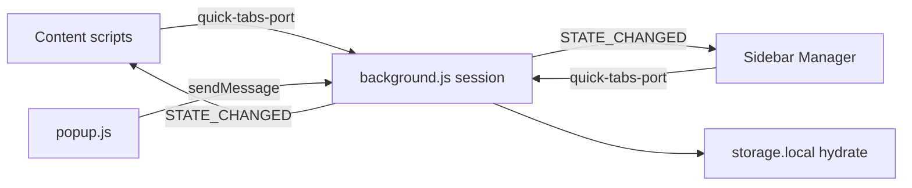

# Message Routing Architecture

## Overview

Option 4: background owns canonical Quick Tab session state. Content scripts and
the sidebar Manager talk primarily over **long-lived ports**
(`runtime.connect` / `quick-tabs-port`). `runtime.sendMessage` /
`tabs.sendMessage` remain for one-shot actions and fallbacks.

Quick Tabs are **tab-scoped** (`originTabId`). Manager may list all QTs; only the
origin tab’s content script restores DOM windows.

## Primary flow

```mermaid
flowchart LR
  CS[Content scripts] -->|quick-tabs-port| BG[background.js session]
  SB[Sidebar Manager] -->|quick-tabs-port| BG
  BG -->|STATE_CHANGED| CS
  BG -->|STATE_CHANGED| SB
  BG --> Local[storage.local hydrate]
  POP[popup.js] -->|sendMessage| BG
```

## MessageRouter

[`src/background/MessageRouter.js`](../../src/background/MessageRouter.js)
registers handlers by action for one-shot `runtime.onMessage` traffic
(QuickTabHandler, TabHandler, LogHandler, TabLifecycleHandler).

Port traffic for Quick Tabs is handled in [`background.js`](../../background.js)
(`onConnect` / port message processors).

## Explicitly removed

- BroadcastChannel / BroadcastManager as a sync bus
- Floating sidebar panel message paths
- Solo / Mute actions
- Content-script writes of canonical QT state (background is source of truth)

## Settings

Settings use `storage.local` via popup and sidebar settings. There is no
`options_page` / `storage.sync` settings path.
