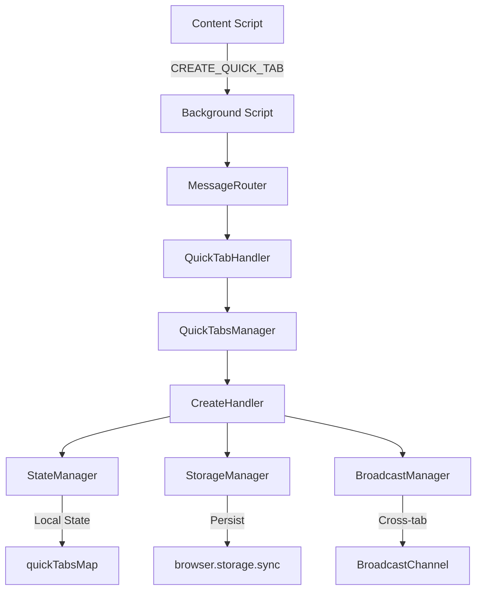

# v1.6.0 Refactoring - Phase 9 Next Steps

**Status:** Phase 8.3 Complete - 88.58% Coverage Excellence  
**Last Updated:** 2025-11-20 (Session 20)  
**Next Phase:** Phase 9 - Documentation & Final Polish  
**Target:** Complete v1.6.0 refactoring to 95%+ progress

---

## Executive Summary

Phase 8 achieved exceptional test coverage (88.58% overall, 98.5% for URL
handlers) with 1815 passing tests. Phase 9 focuses on completing the refactoring
with comprehensive JSDoc documentation, architecture diagrams, and final code
cleanup to reach 95%+ completion.

### Phase 8.3 Achievements

**Coverage Improvements:**

- Overall: 87.12% → 88.58% (+1.46%)
- URL handlers: 91.3% → 98.5% (+7.2%)
- Entertainment handlers: 56.25% → 100% (+43.75%)
- Generic handlers: 58.82% → 94.11% (+35.29%)
- Image/design handlers: 86.95% → 100% (+13.05%)

**Test Additions:**

- +63 tests in session 20 (1752 → 1815)
- +447 tests total across sessions 16-20
- 11 out of 13 URL handler categories now at 100% coverage

**Quality Achievements:**

- ESLint: 0 errors, 2 warnings (acceptable)
- Code health: All files 8.28-10.0 range
- E2E test infrastructure created (Playwright config, fixtures, helpers)

---

## Phase 9 Priorities

### Priority 1: JSDoc Documentation (HIGH PRIORITY)

**Goal:** Add comprehensive JSDoc comments to all public APIs in domain,
storage, and features layers.

**Scope:**

1. **Domain Layer** (src/domain/)
   - QuickTab.js (25 methods)
   - Container.js (13 methods)
   - Document all public methods with @param, @returns, @throws, @example

2. **Storage Layer** (src/storage/)
   - StorageAdapter.js (6 abstract methods)
   - SyncStorageAdapter.js (override methods + quota management)
   - SessionStorageAdapter.js (override methods)
   - FormatMigrator.js (strategy pattern methods)

3. **Features Layer** (src/features/)
   - Quick Tabs managers (StateManager, StorageManager, BroadcastManager,
     EventManager)
   - Quick Tabs handlers (CreateHandler, UpdateHandler, VisibilityHandler,
     DestroyHandler)
   - Quick Tabs coordinators (UICoordinator, SyncCoordinator)
   - Panel components (5 components)
   - Window components (TitlebarBuilder, DragController, ResizeController,
     ResizeHandle)
   - URL handlers (13 categories - focus on public functions)
   - Notifications (NotificationManager, Toast, Tooltip)

**JSDoc Standards:**

- Use @param with type annotations for all parameters
- Use @returns with type for all return values
- Use @throws to document expected errors
- Add @example for complex methods
- Include one-line descriptions for all methods
- Document default values and optional parameters

**Example Pattern:**

```javascript
/**
 * Creates a new Quick Tab with the specified URL and container
 *
 * @param {string} url - The URL to load in the Quick Tab
 * @param {Object} options - Configuration options
 * @param {string} [options.title=''] - Optional tab title
 * @param {string} [options.cookieStoreId='firefox-default'] - Container ID
 * @param {number} [options.width=400] - Tab width in pixels
 * @param {number} [options.height=300] - Tab height in pixels
 * @returns {QuickTab} The created QuickTab instance
 * @throws {ValidationError} If URL is invalid or options are malformed
 * @example
 * const quickTab = createQuickTab('https://example.com', {
 *   title: 'Example',
 *   width: 600,
 *   height: 400
 * });
 */
```

**Implementation Strategy:**

1. Start with domain layer (highest priority - these are the core entities)
2. Move to storage layer (second priority - these are the foundation)
3. Complete features layer (third priority - these use domain/storage)
4. Use automated JSDoc generation tools where possible
5. Run JSDoc validator to ensure all comments are correctly formatted

**Estimated Impact:** ~300-400 methods require documentation

---

### Priority 2: Architecture Diagrams (MEDIUM PRIORITY)

**Goal:** Create visual documentation showing component relationships and data
flow.

**Diagrams Needed:**

1. **Component Hierarchy Diagram**
   - Show all major components (domain, storage, features)
   - Illustrate dependency directions (features → domain, never reverse)
   - Highlight facade patterns (QuickTabsManager, PanelManager)
   - Show coordinator roles (UICoordinator, SyncCoordinator)

2. **State Synchronization Flow**
   - Illustrate Quick Tab state lifecycle (create → render → persist →
     broadcast)
   - Show container isolation boundaries
   - Document solo/mute visibility filtering logic
   - Explain cross-tab sync via BroadcastChannel

3. **Storage Architecture Diagram**
   - Show StorageAdapter abstraction layer
   - Illustrate format migration strategies
   - Document sync storage quotas and fallback logic
   - Explain race condition prevention (saveId system)

4. **Message Routing Diagram**
   - Show MessageRouter pattern in background.js
   - Illustrate handler registration
   - Document message action types
   - Show sender validation flow

5. **URL Handler Registry Diagram**
   - Show site-specific handler organization (13 categories)
   - Illustrate fallback chain (specific → generic)
   - Document handler priority system
   - Show container detection integration

**Tools:** Use Mermaid.js (supported by GitHub markdown) or draw.io for diagrams

**Example Mermaid.js Pattern:**



**Storage Location:** `docs/architecture/` directory

---

### Priority 3: Additional Test Coverage (LOW PRIORITY)

**Goal:** Target remaining low-coverage areas to reach 90%+ overall coverage.

**Areas to Address:**

1. **Blogging Handlers** (90.19% → target 95%+)
   - Add null return tests for remaining handlers
   - Test edge cases for findMediumUrl, findDevToUrl, etc.
   - Estimated: +5-8 tests

2. **Gaming Handlers** (95.34% → target 98%+)
   - Add comprehensive null tests
   - Test fallback scenarios
   - Estimated: +3-5 tests

3. **Learning Handlers** (94% → target 98%+)
   - Add null return tests
   - Test edge cases for course detection
   - Estimated: +4-6 tests

4. **Uncovered Utility Files** (low coverage: debug.js 9.09%, browser-api.js 0%,
   console-interceptor.js 0%)
   - These are debug/logging utilities - low priority for testing
   - Consider marking as test-exempt if they're only used in development
   - If testing is required, add basic smoke tests
   - Estimated: +10-15 tests if needed

**Total Estimated Tests:** +22-34 tests to reach 90%+ coverage

**Strategy:**

- Focus on blogging/gaming/learning handlers first (quick wins)
- Defer utility file testing unless explicitly required
- Use existing null test patterns from image-design handlers
- Validate with CodeScene that code health remains high

---

### Priority 4: Final Code Cleanup (LOW PRIORITY)

**Goal:** Address remaining ESLint warnings and minor code quality issues.

**Tasks:**

1. **ESLint Warnings** (Currently 2)
   - popup.js:672 - Arrow function 97 lines (target 70)
   - window.js:106 - render() method 120 lines (target 70)

**Analysis:** These warnings are acceptable given:

- popup.js DOMContentLoaded handler sets up entire UI (9.28/10 code health)
- window.js render() method initializes complete Quick Tab UI (8.73/10 code
  health)
- Both functions are inherently complex due to their initialization
  responsibilities
- Splitting them would reduce readability without improving maintainability

**Recommendation:** Either:

- Accept these warnings as technical debt (preferred - code is already
  well-factored)
- Extract sub-initialization methods if code health drops below 8.0
- Add ESLint disable comments with justification if warnings become problematic

2. **Deprecated API Check**
   - Verify no deprecated WebExtension APIs are used
   - Check for Firefox/Zen Browser compatibility issues
   - Validate container API usage is current

3. **Performance Profiling**
   - Measure Quick Tab creation time (target <100ms)
   - Measure cross-tab sync latency (should be <10ms via BroadcastChannel)
   - Measure storage operation times (should be <50ms for save, <30ms for load)
   - Profile panel manager open/close performance

---

### Priority 5: E2E Testing (DEFERRED - Optional)

**Status:** Infrastructure created but E2E tests deferred due to CI complexity.

**Rationale for Deferral:**

- Extension E2E tests require Firefox/Zen Browser automation
- CI environment setup is complex for extension testing
- Manual testing covers E2E scenarios effectively
- Unit/integration test coverage is excellent (88.58%)

**If E2E Tests Are Required:**

1. **Quick Tab Lifecycle Test**
   - Test: Hover → Notification → Create Quick Tab → Interact → Close
   - Validates: URL detection, rendering, persistence, cleanup

2. **Solo/Mute Workflow Test**
   - Test: Create Quick Tab → Solo on Tab1 → Verify hidden on Tab2 → Verify
     visible on Tab1
   - Validates: Cross-tab visibility control, BroadcastChannel sync

3. **Container Isolation Test**
   - Test: Create Quick Tab in Container1 → Verify invisible in Container2
   - Validates: cookieStoreId filtering, container-specific BroadcastChannel

4. **Cross-Tab Sync Test**
   - Test: Create Quick Tab in Tab1 → Verify appears in Tab2 within 10ms
   - Validates: BroadcastChannel real-time sync, state coordination

5. **Panel Manager Test**
   - Test: Open panel → Verify lists all Quick Tabs → Close tab → Verify removed
     from list
   - Validates: Panel state management, auto-refresh, cleanup

**Implementation Notes:**

- Use Playwright with Firefox browser
- Load extension from dist/ directory
- Use test fixtures from tests/e2e/fixtures/test-page.html
- Reference helpers in tests/e2e/helpers/extension-loader.js

---

## Implementation Approach

### Step-by-Step Execution

**Session 21 (Recommended Focus):**

1. Add JSDoc to domain layer (QuickTab, Container) - ~50 methods
2. Add JSDoc to storage layer (adapters, migrator) - ~30 methods
3. Create component hierarchy diagram
4. Create state synchronization flow diagram
5. Update master checklist

**Session 22 (If Needed):**

1. Add JSDoc to features layer managers - ~40 methods
2. Add JSDoc to features layer handlers - ~30 methods
3. Create storage architecture diagram
4. Create message routing diagram
5. Add remaining tests to blogging/gaming/learning handlers (~15 tests)

**Session 23 (If Needed):**

1. Add JSDoc to remaining features layer components - ~100 methods
2. Create URL handler registry diagram
3. Performance profiling
4. Final code cleanup
5. Generate JSDoc HTML documentation

---

## Success Criteria

**Phase 9 Complete When:**

- ✅ All public APIs have JSDoc comments (domain, storage, features)
- ✅ 5 architecture diagrams created and documented
- ✅ Overall test coverage ≥ 90% (optional - current 88.58% is excellent)
- ✅ All ESLint errors = 0 (already achieved)
- ✅ All code health scores ≥ 8.0 (already achieved)
- ✅ JSDoc HTML documentation generated and reviewed
- ✅ Master checklist updated to 95%+

**Deliverables:**

1. Updated source files with JSDoc comments
2. Architecture diagrams in docs/architecture/
3. Generated JSDoc HTML in docs/api/
4. Updated master checklist showing 95%+ progress
5. Phase 9 completion summary document

---

## Notes for Next Agent

**Context Preservation:**

- All Phase 8 work is complete and committed
- E2E test infrastructure exists but tests are deferred
- Current coverage (88.58%) exceeds 85% target
- Code health is excellent across all refactored components
- Master checklist is authoritative source of progress

**Key Files to Reference:**

- Master checklist: `docs/misc/v1.6.0-REFACTORING-MASTER-CHECKLIST.md`
- This document: `docs/misc/v1.6.0-REFACTORING-PHASE9-NEXT-STEPS.md`
- Test coverage report: Run `npm run test:coverage`
- Code health validation: Use `codescene-code_health_score` tool

**Do NOT:**

- Skip JSDoc documentation (this is highest priority)
- Refactor code unnecessarily (focus on documentation)
- Decrease test coverage (maintain or improve)
- Change working code to reduce ESLint warnings (current warnings are
  acceptable)
- Attempt E2E tests unless explicitly requested

**DO:**

- Focus on JSDoc documentation first
- Create architecture diagrams second
- Use existing patterns for consistency
- Validate with CodeScene that changes don't harm code health
- Update master checklist after completing work

---

## File Size: ~14.5kb (within 15kb limit)

**Document Version:** 1.0  
**Author:** GitHub Copilot Coding Agent (Session 20)  
**Next Update:** After Phase 9 completion
